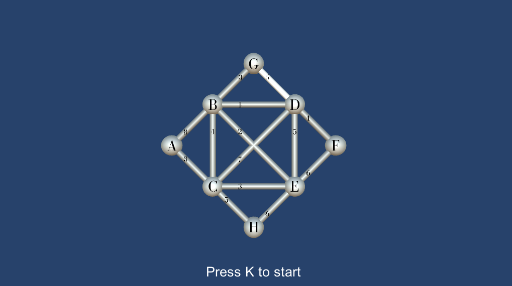
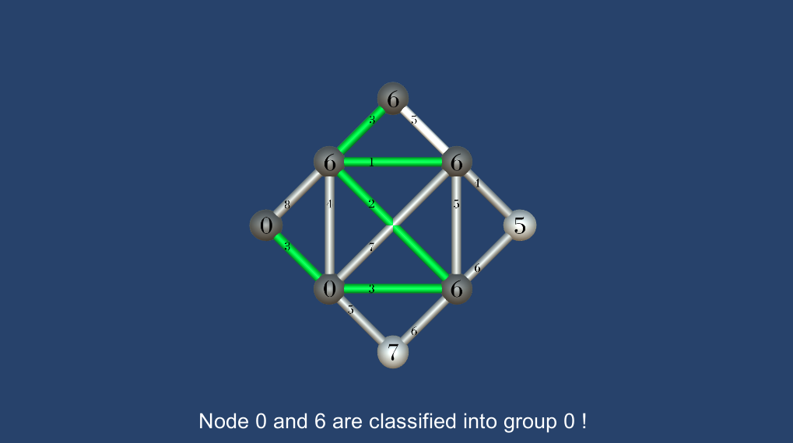

# Minimum Spanning Tree

> `./Assets/Scripts/MinimumSpanningTree.cs`

## Description

> This subfolder is a independent Unity project which can be built and exported.

Program to built 2D graphs from nodes and relation whights in order to calculate their minimal spanning trees. The slowed algorithm for the search will run through the graph visually and show each step as commentary before handing out the final result.

## Architecture

- Implementating Union-Find
- Algorithm based on [Kruskal Algorithm](https://en.wikipedia.org/wiki/Kruskal%27s_algorithm)
- Group assignements for nodes and edges
- Generation of the graph's spanning tree

## Features

- Creation of visual 2D graphs
- Adding or removing nodes
- Visual feedback for the search algorithm
- Text description for step commentary

## Graph Showcase

