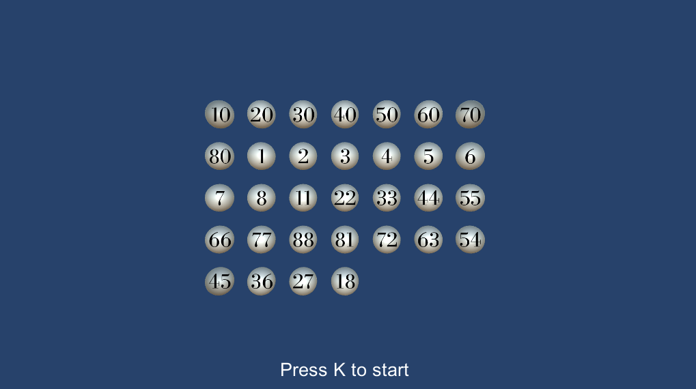

# Insertion Sort

> `./Assets/Scripts/InsertionSort.cs`

## Description

> This subfolder is a independent Unity project which can be built and exported.

Program to generate and sort numbered 2D nodes based on the insertion sort algorithm. The slowed algorithm will run through nodes visually and show each step as commentary before handing out the final result.

## Architecture

Insertion sort is an in-place comparison sorting algorithm. It works by iterating through the node list, removing one element at a time, and inserting it into the correct position in the list. The algorithm maintains a sorted sublist in the lower portion of the list. Each iteration of the outer loop removes one element from the unsorted sublist and inserts it into the correct position in the sorted sublist.

## Features

- Creation of visual 2D nodes
- Adding or removing nodes
- Visual feedback for the sort algorithm
- Text description for step commentary

## Showcase

